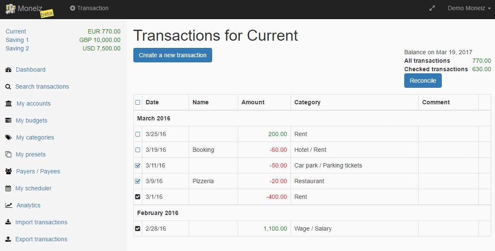

# Meziantou.Moneiz

Moneiz is a web application for managing your bank accounts:

- See all the transactions in one place
- Plan recurring transactions (salary, rent, electricity, etc.)
- Categorize transactions and analyze spending using charts
- Search for transactions using many criteria
- Create budgets (i.e. $200 per month for leisure activities)
- Import and export transactions of all your accounts in the most common formats (Excel, OFX, QIF, CSV)

A hundred currencies are supported with their conversion rates.

